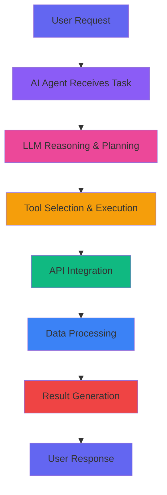

  

  
  
  

---

## 🧠 **AI Agent Architect & LLM Orchestrator**

> *"Empowering AI to think, plan, and act autonomously"*

I specialize in building **intelligent autonomous systems** that bridge the gap between AI reasoning and real-world action. My expertise lies in creating AI agents that can independently complete complex tasks using the **Praison Framework** and modern LLM orchestration.

---

## 🚀 **What I Build**

<table>
  <tr>
    <td width="50%">
      <h3 align="center">🤖 Autonomous Agents</h3>
      

        AI systems that operate independently to achieve complex goals, from research automation to project management.
      

    </td>
    <td width="50%">
      <h3 align="center">🔗 LLM Orchestration</h3>
      

        Seamless integration of GPT-4/3.5 with tools, memory, and external APIs for enhanced reasoning capabilities.
      

    </td>
  </tr>
  <tr>
    <td width="50%">
      <h3 align="center">☁️ Cloud Integration</h3>
      

        Connecting AI agents to real-world systems via Google APIs, GitHub, Slack, and cloud databases.
      

    </td>
    <td width="50%">
      <h3 align="center">🛠️ Scalable Backends</h3>
      

        Building robust, production-ready AI agent systems with proper error handling and monitoring.
      

    </td>
  </tr>
</table>

---

## 🎯 **Featured Projects**

  <table>
    <tr>
      <td width="50%">
        

          
        

      </td>
      <td width="50%">
        

          
        

      </td>
    </tr>
    <tr>
      <td width="50%">
        

          
        

      </td>
      <td width="50%">
        

          
        

      </td>
    </tr>
  </table>

---

## 🛠️ **Tech Arsenal**

  <h3>🤖 AI & Machine Learning</h3>
  
  
  
  
  
  <h3>🌐 Web Development</h3>
  
  
  
  
  
  <h3>☁️ Cloud & Databases</h3>
  
  
  
  

---

## 📊 **AI Agent Development Stats**

  
  

  

---

## 🎨 **AI Agent Workflow**

---

## 🌟 **Why AI Agents Matter**

> *"The future isn't about AI that can answer questions—it's about AI that can take action."*

I believe in building AI systems that don't just **think**, but **act**. My agents can:
- 🔍 **Research autonomously** across multiple sources
- 📅 **Manage your calendar** and send intelligent reminders
- 🧰 **Automate DevOps** tasks and code reviews
- 💬 **Handle customer support** with context awareness
- 📊 **Analyze data** and generate insights
- 🎯 **Execute complex workflows** end-to-end

---

## 🤝 **Let's Build the Future Together**

  <h3>Ready to create intelligent AI agents?</h3>
  
  
  
  

---

## 🎯 **Current Mission**

  

---

  
  
  
<em>Building the future, one AI agent at a time 🚀</em>

 
